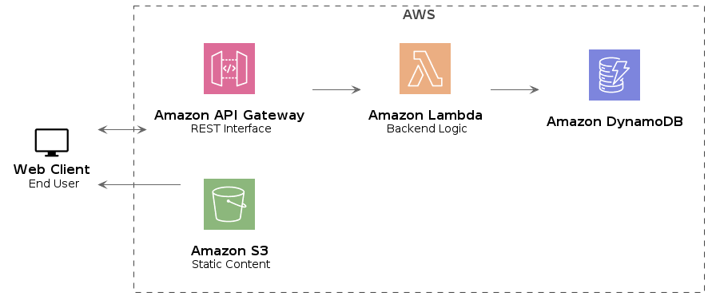
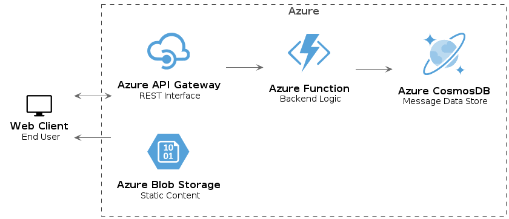
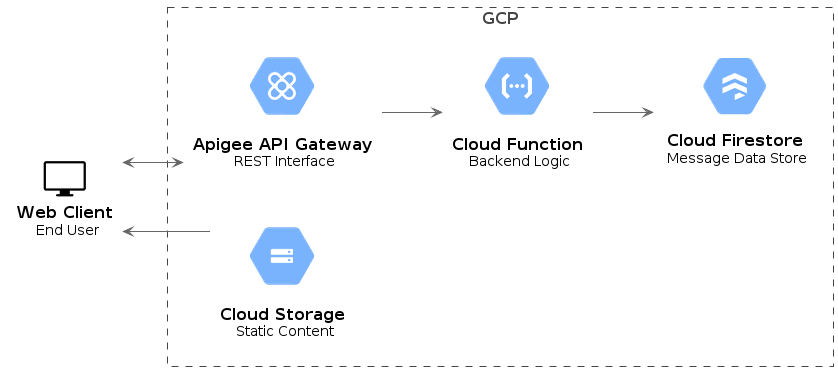

# PlantUML 

I am very fascinated with Diagram as a code concept and below are some of the serverless architecture examples for different cloud providers using PlantUML.

Source code diagrams are located [here](https://github.com/kacpura/kacpura.github.io/tree/main/src)

## Example of Diagrams Generated from code 

### AWS Serveless Architecture example

### Azure Servless Architecture example

### GCP Servless Architecture example

